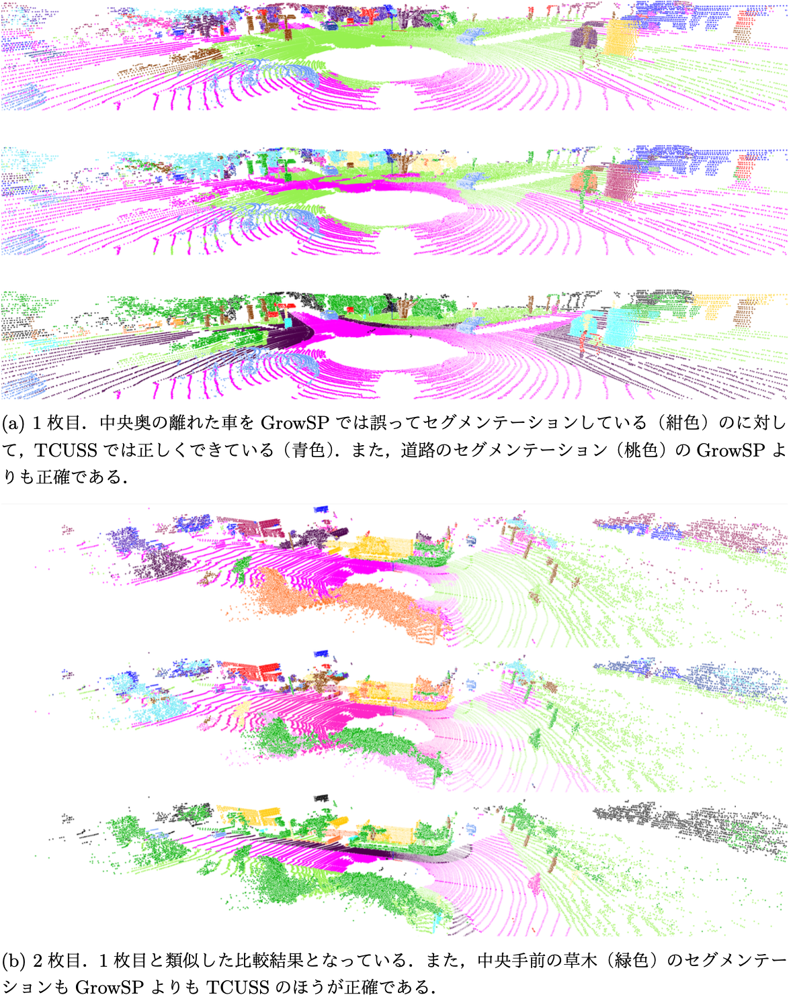

# TCUSS: Temporal Consistent Unsupervised Semantic Segmentation of 3D Point Clouds

先行研究(GrowSP)との比較。上がGrowSP、中央がTCUSS、下がGround-Truth。

## プロジェクト概要

TCUSSは、点群のみを入力としたUnsupervised Semantic Segmentationの新しい手法です。GrowSPの学習機構に、運転シーンの3D点群に特化した対照学習手法であるTARLを導入することで、運転シーン向けに最適化されています。TCUSSのモチベーションを簡潔にまとめると次のとおりです。


- 運転シーンにおける点群データの特徴
  - 時系列データ：10Hzのセンサーで自車を中心とした周囲環境を点群に変換
  - 難点：自車の動きや移動する物体の存在により、物体の見え方がフレームごとに大きく異なる
- GrowSPとその限界
  - Superpointと呼ばれる小さな点の集合を基に、学習の間で逐次的に統合していく
  - 単一のフレーム毎に学習しているため、時系列情報を活用できず、物体の見え方の変化に対応しにくい
- TARL
  - 運転シーンに特有の物体の見え方の変化に影響されない一貫した特徴量を学習する手法
  - 対照学習によって、時刻が近い2つの点群からそれぞれ抽出される特徴量 F^{t_1} と F^{t_2} を、同じ物体の場合のみ近づけるように特徴量抽出器を学習する
- → GrowSPにTARLの学習機構を導入

## 使用方法
### train

```bash
CUDA_VISIBLE_DEVICES=0,1,2,3 python train_SemanticKITTI.py \
  --name experiment_name \
  --save_path data/users/minesawa/semantickitti/experiment_name \
  --workers 8 --cluster_workers 8 \
  --batch_size 16 16 
```

### eval

```bash
python eval_SemanticKITTI.py \
  --data_path data/users/minesawa/semantickitti/growsp \
  --sp_path data/users/minesawa/semantickitti/growsp_sp \
  --save_path data/users/minesawa/semantickitti/experiment_name
```

### submit

```bash
./test_SemanticKITTI.sh data/users/minesawa/semantickitti/experiment_name submission_name.zip
```

## 主要パラメータ

| パラメータ名 | 説明 |
|------------|------|
| --name | 実験名 |
| --save_path | モデル保存パス |
| --data_path | 点群データパス |
| --sp_path | 初期スーパーポイントパス |
| --workers | データローディング用ワーカー数 |
| --cluster_workers | クラスタリング用ワーカー数 |
| --batch_size | 学習時のバッチサイズ [GrowSP, TARL] |
| --max_epoch | 最大エポック数 [非成長段階, 成長段階] |
| --select_num | 各ラウンドで選択されるシーン数 |
| --eval_select_num | 評価時に選択されるシーン数 |
| --cluster_interval | クラスタリングの間隔 |

## プロジェクト構造

- `train_SemanticKITTI.py`: メイン学習スクリプト
- `eval_SemanticKITTI.py`: 評価スクリプト
- `test_SemanticKITTI.py`: テスト用スクリプト
- `test_SemanticKITTI.sh`: テストと提出自動化シェルスクリプト
- `datasets/SemanticKITTI.py`: SemanticKITTIデータセット処理
- `models/`: ネットワークモデル定義
- `lib/`: ユーティリティ関数群

## 参考文献
[GrowSP](https://openaccess.thecvf.com/content/CVPR2023/papers/Zhang_GrowSP_Unsupervised_Semantic_Segmentation_of_3D_Point_Clouds_CVPR_2023_paper.pdf)

[TARL](https://openaccess.thecvf.com/content/CVPR2023/papers/Nunes_Temporal_Consistent_3D_LiDAR_Representation_Learning_for_Semantic_Perception_in_CVPR_2023_paper.pdf)