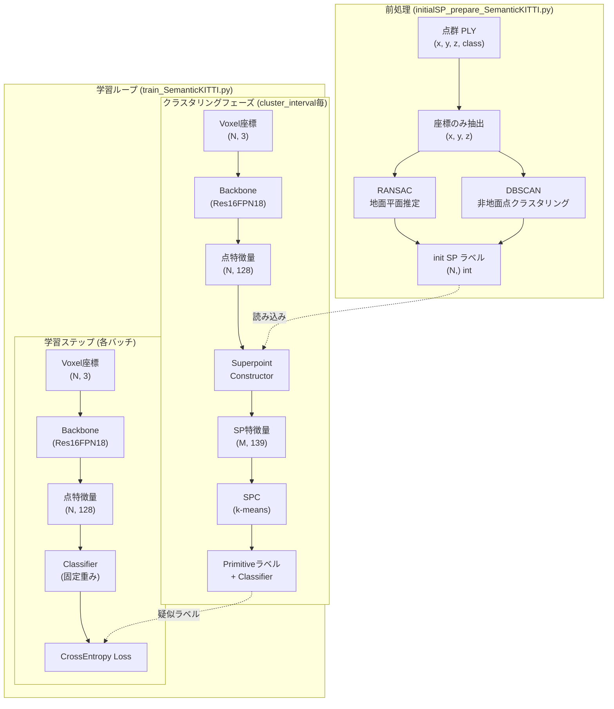
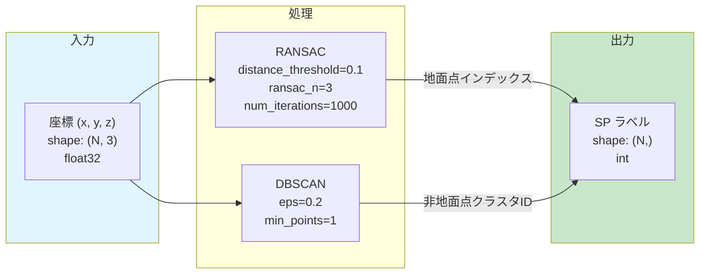
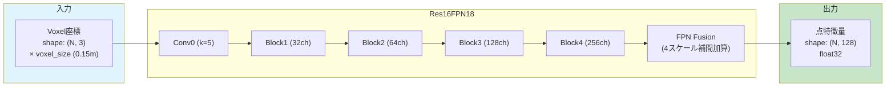
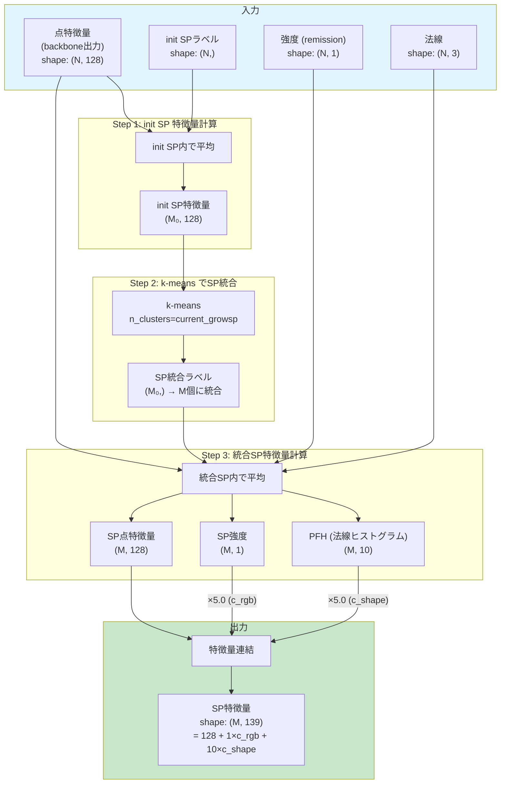
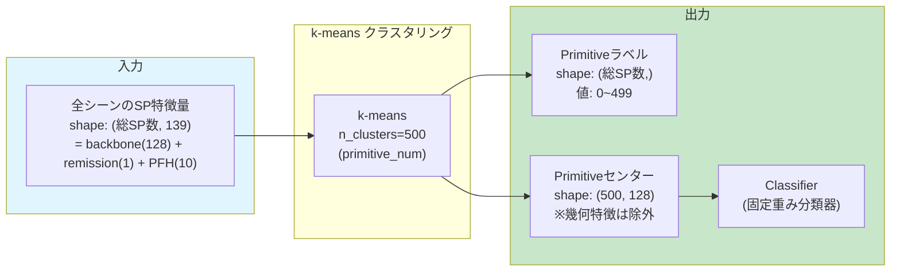
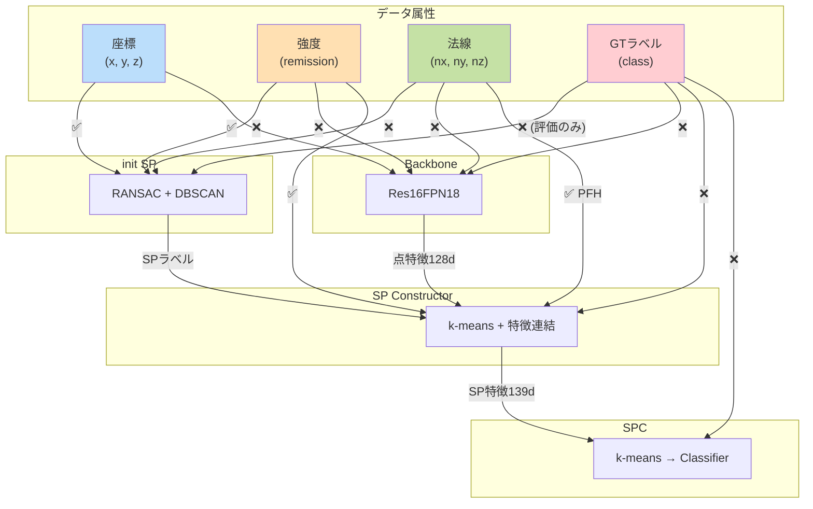

# TCUSS 処理フロー

このドキュメントでは、TCUSSの主要な処理フロー（init SP, backbone, Superpoint Constructor, SPC）における入出力を図示します。

## 全体フロー概要

---

## 各処理の詳細

### 1. init SP の作成

**ファイル**: `data_prepare/initialSP_prepare_SemanticKITTI.py`

**ポイント**:
- ✅ 使用: 座標 (x, y, z) のみ
- ❌ 未使用: 強度 (remission), クラスラベル (GT)
- クラスラベルは品質評価（mIoU計算）のみに使用

---

### 2. Backbone (Res16FPN18)

**ファイル**: `models/fpn.py`, `lib/trainer.py`

**ポイント**:
- ✅ 使用: Voxel座標 (x, y, z) のみ (`input_dim=3`)
- ❌ 未使用: 強度 (remission), 法線, 色
- MinkowskiEngine による Sparse 3D Convolution

---

### 3. Superpoint Constructor (GrowSP)

**ファイル**: `lib/utils.py` (`get_kittisp_feature` 関数)

**ポイント**:
- ✅ 使用:
  - 点特徴量 (backbone出力): 128次元
  - 強度 (remission): 1次元 × c_rgb (5.0)
  - 法線 → PFH: 10次元 × c_shape (5.0)
  - init SPラベル: 点をSPにグループ化
- GrowSP: エポック進行に伴い `current_growsp` を 80 → 30 に減少

---

### 4. Semantic Primitive Clustering (SPC)

**ファイル**: `lib/trainer.py` (`cluster` 関数), `lib/utils.py`

**ポイント**:
- ✅ 使用: SP特徴量 (139次元) 全体でk-means
- 出力の分類器重みは backbone特徴 (128次元) のみ使用
- `select_num=1500` シーンからSP特徴を収集

---

## 情報フローサマリー

---

## ハイパーパラメータ一覧

| 処理 | パラメータ | デフォルト値 | 説明 |
|------|-----------|-------------|------|
| **init SP** | `distance_threshold` | 0.1 | RANSAC距離閾値 (m) |
| | DBSCAN `eps` | 0.2 | クラスタリング距離 (m) |
| | DBSCAN `min_points` | 1 | 最小点数 |
| **Backbone** | `input_dim` | 3 | 入力次元 (座標のみ) |
| | `feats_dim` | 128 | 出力特徴次元 |
| | `voxel_size` | 0.15 | Voxelサイズ (m) |
| | `conv1_kernel_size` | 5 | 初期畳み込みカーネル |
| | `bn_momentum` | 0.02 | BatchNormモメンタム |
| **SP Constructor** | `growsp.start` | 80 | 初期SP数 |
| | `growsp.end` | 30 | 最終SP数 |
| | `growsp.c_rgb` | 5.0 | 強度特徴の重み |
| | `growsp.c_shape` | 5.0 | PFH特徴の重み |
| **SPC** | `primitive_num` | 500 | Primitive数 |
| | `select_num` | 1500 | クラスタリング用シーン数 |

